  
  <h1>
    Hey there, I'm Xavier Renjiro! 
    
  </h1>
  
  
<strong>A Computer Science Student & Cyber Security Enthusiast from Indonesia with a passion for building secure and functional applications.</strong>

  

--- 

###  A Little More About Me...

I’m a Computer Science student and Cyber Security enthusiast who enjoys turning big ideas into something real, whether it’s building an app, experimenting with AI, or breaking down security systems (the ethical way, of course 😎).

For me, coding isn’t just about solving problems, it’s like a puzzle game that I never get tired of playing. I love the challenge of making things simple, useful, and maybe a little fun along the way.

When I’m not behind the keyboard, you’ll probably find me exploring new ideas, designing something, or just running to clear my head (yes, literally running 🏃).

When I'm not at my keyboard, you can probably find me [mention a hobby or two, e.g., exploring new coffee shops, hiking up a mountain, getting lost in a good book, or playing my guitar].

---

### 💻 My Tech Stack & Tools

Here are some of the technologies I love to work with. I'm always eager to learn more!

  

### 🧑‍🎨 My Design & Editing Tools

And here are some of the technologies and tools I use to make my graphic design, photo or video editing, 3D visiolization, etc.

  

---

### 🌱 What I'm Up To Right Now

* 🚀 **Building:** Currently working on [Name of a project and a brief, exciting description], a project that aims to solve [the problem].
* 🌱 **Learning:** Diving deeper into [A technology, framework, or concept, e.g., Go, WebAssembly, Machine Learning].
* 🤝 **Collaborating:** I'm open to collaborating on interesting open-source projects, especially those related to [Your field of interest, e.g., developer tools, education, sustainability].
* 💬 **Let's Talk:** Feel free to ask me about anything related to [Your areas of expertise, e.g., React, Python automation, UI/UX design].

---

### 📫 Let's Connect!

This is my little corner of the internet. Feel free to look around, and if you like what you see, let's connect!

  
  
  
  

---

### 📊 My GitHub Stats

  
  
  
   
  
  

   
  
  
  
   
  
  

